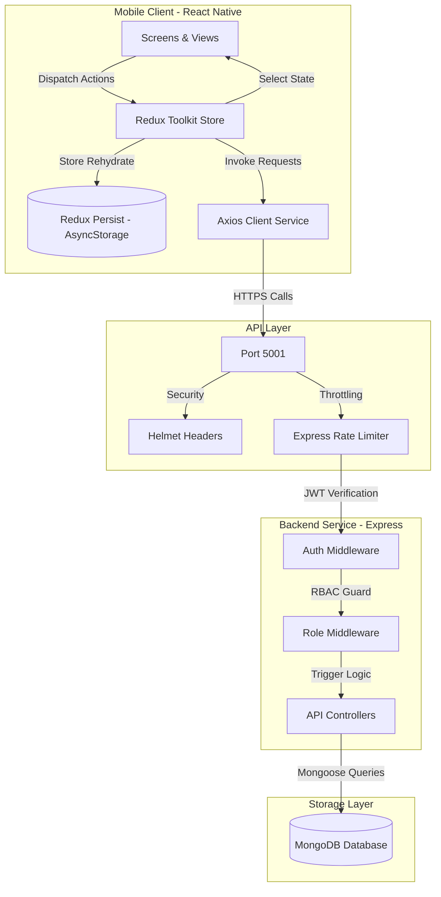
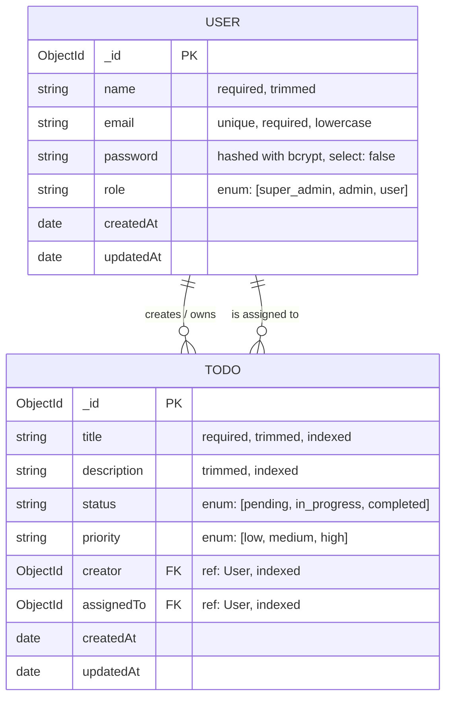
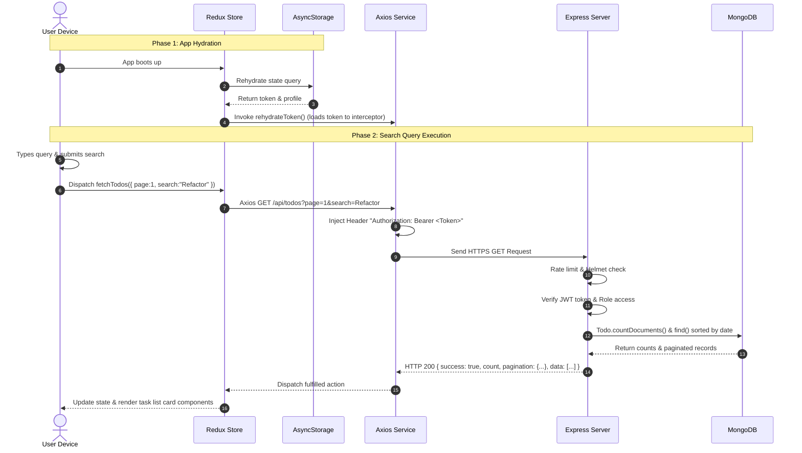

# WorkSphere Production & System Design Documentation

This document provides system design diagrams, security blueprints, and developer interview questions detailing the engineering considerations behind the WorkSphere platform.

---

## 📊 System Diagrams

### 1. Architecture Diagram
The high-level architecture maps our React Native mobile application to the Node.js/Express.js backend and MongoDB database.



---

### 2. Database Schema (ERD)
The relationship between users and todos is modeled as a 1-to-many relationship (one user can create or be assigned to many tasks). Mongoose indexes are established to optimize read performance.



---

### 3. Sequence Diagram (App Hydration & Paginated Search)
This sequence diagram details the runtime lifecycle starting from app launch, token hydration, and executing a search request.



---

## 💡 Developer Interview Questions & Answers

### Q1: How is Role-Based Access Control (RBAC) designed and secured in the backend?
**Answer:** RBAC is implemented using a custom middleware factory `authorize(...roles)`. It runs after the `protect` middleware, which decodes the JWT and fetches the user's role from the database, storing it in `req.user`. The authorization middleware compares the roles allowed on the route against `req.user.role`. If unauthorized, it responds with `403 Forbidden` early, stopping execution before reaching the controller.
```javascript
const authorize = (...roles) => (req, res, next) => {
  if (!roles.includes(req.user.role)) {
    return res.status(403).json({ success: false, message: 'Forbidden' });
  }
  next();
};
```

### Q2: How does Redux Persist rehydrate the user state, and how do we ensure Axios is synced with the token?
**Answer:** Redux Persist reads the stored payload from native `AsyncStorage` during store initialization and hydrates the Redux state. To ensure Axios attaches the token correctly, we dispatch a custom action `rehydrateToken` inside a `useEffect` at the navigator root level as soon as `isAuthenticated` and `token` are verified in Redux. This updates a module-scoped token variable in the Axios service, ensuring subsequent API calls automatically append the token in headers.

### Q3: What measures were taken to prevent SQL Injection-equivalent attacks and Mongoose schema vulnerabilities?
**Answer:**
1. **Input Sanitization**: Used `express-validator` to strictly type check and normalize all incoming parameters (e.g. `normalizeEmail()`, checking mongoIds).
2. **Rate Limiting**: Added `express-rate-limit` to restrict client IP requests to 100 per 15-minute window, defending against brute-force logins.
3. **HTTP Header Hardening**: Integrated `helmet` to configure strict HTTP security headers (e.g. X-Content-Type-Options, Content-Security-Policy).
4. **Parameterized Mongoose Queries**: Used built-in Mongoose querying instead of parsing raw code blocks, preventing NoSQL injection.

### Q4: Explain the difference in Mongoose indexing added for search versus active filters.
**Answer:**
- **Text Search Index**: We added a compound text index `TodoSchema.index({ title: 'text', description: 'text' })` to support full-text index lookups.
- **Filter and Sorting Indexes**: We added single-field indexes on `assignedTo`, `status`, and `priority` to speed up exact-match filters, and a compound index `TodoSchema.index({ creator: 1, createdAt: -1 })` to accelerate personal dashboard listings which are queried by owner and sorted chronologically.

### Q5: How was the pagination strategy designed to ensure smooth scrolling on the React Native client?
**Answer:** Offset pagination is utilized. The backend accepts `page` and `limit` query parameters, calculates database offsets (`skip`), fetches the slice, and counts the matching results.
The React Native client maintains `page` in the component state. When the user scrolls near the bottom, `onEndReached` is fired, requesting the next page if `page < totalPages`. The Redux reducer appends incoming items to the state, while filtering out potential duplicates to guarantee UI stability.

### Q6: How does the client handle offline scenarios or backend service failures?
**Answer:** We implemented a request error-catcher logic. If an Axios request times out or throws a network connection exception, the Redux slice stores the error string. The `TodoListScreen` displays a premium, red error alert banner at the top, notifying the user. The banner contains a **Retry** button which allows the user to re-trigger a fresh database load once connection resumes.

### Q7: Why is it important to use `select: false` on user passwords in Mongoose schema design?
**Answer:** By configuring `password: { type: String, select: false }`, we ensure database query projections (like `User.find()` or `.populate()`) do not return the hashed password in server logs or API payloads. The password hash is only fetched on login requests using the manual select query addition: `.select('+password')`.

### Q8: How do we prevent memory leaks and React warnings inside the FlatList scroll events?
**Answer:**
- Bound key extractors using database `_id` strings (`keyExtractor={(item) => item._id}`).
- Memoized fetching callbacks using `useCallback` to prevent redraw triggers on subcomponent renders.
- Maintained a boolean `loadingMore` state to prevent concurrent fetch triggers when `onEndReached` fires multiple times.

### Q9: Why did we restrict the backend Jest runner scanning roots?
**Answer:** By default, running `jest` in a repository root scans all subfolders recursively. Since our React Native client folder contains TypeScript files, JSX elements, and `@react-native` imports, Node.js Jest throws syntax exceptions. Restricting Jest to `"roots": ["<rootDir>/tests"]` keeps backend testing isolated and fast.

### Q10: How does the seeder handle credentials on deployment setups?
**Answer:** The seeder checks `process.env.SUPER_ADMIN_EMAIL` and `process.env.SUPER_ADMIN_PASSWORD` on server boots. If these variables are not provided, it falls back to secure defaults. If a user with the role `super_admin` already exists in the connected database cluster, it skips creation entirely to prevent overwriting existing administrative data.

---

## 📈 Future Enhancements Roadmap

1. **Caching**: Integrate a **Redis** cache layer for listing todos to decrease database read cycles.
2. **Containerization**: Define `Dockerfile` and `docker-compose.yml` to orchestrate backend and MongoDB instances inside isolated container systems.
3. **Clustering**: Run backend instances using **PM2** process managers to balance requests across multi-core processors.
4. **Push Notifications**: Attach FCM (Firebase Cloud Messaging) triggers on the server to notify mobile users when tasks are assigned to them.
